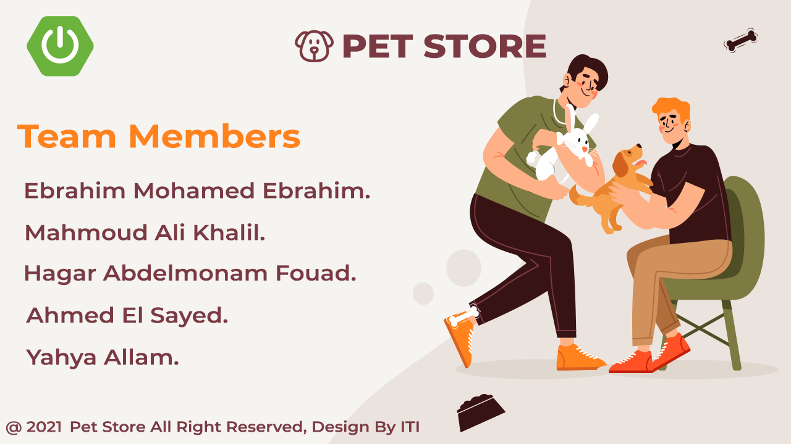

# Pet Store
[](https://www.oracle.com/java/)
[](https://www.spring.io/)
[](https://spring.io/projects/spring-boot)
[](https://www.apache.org/)
[](https://www.mysql.com/)
[](https://hibernate.org/)
[](https://www.angular.io/)
[](https://www.typescriptlang.org/)
[](https://developer.mozilla.org/en-US/docs/Learn/HTML/Introduction_to_HTML)
[](https://developer.mozilla.org/en-US/docs/Web/CSS/Reference)
[](https://getbootstrap.com/)
[](https://aws.amazon.com/)
[](https://www.jetbrains.com/idea/)
 
## Getting Started

### Prerequisites
- Java 11
- Mysql
- Apache Maven

### Installation

1- Expose the following environment variables:
#### Linux
```shell
export DB_USERNAME=username \
export DB_PASSWORD=password \
export PET_STORE_APPLICATION_PORT=80
```
#### Windows
```shell
setx DB_USERNAME "username" ^
setx DB_PASSWORD "password" ^
setx PET_STORE_APPLICATION_PORT "80"
```

## Contributors
1. Ahmed El Sayed.
2. Ebrahim Mohamed Ebrahim.
3. Hagar Abdelmonam Fouad.
4. Mahmoud Ali Khalil.
5. Yahya Allam.

